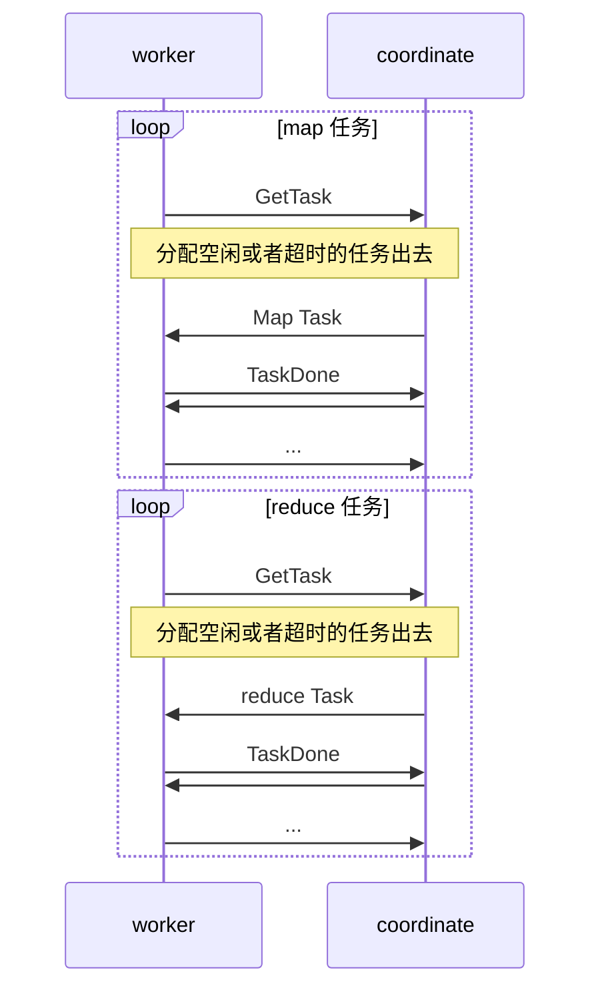

> 最近在学习 MIT 6.824 分布式系统课程，以 lab 维度记录自己的学习心得。

## 前置准备

[6.824 官方课程安排链接](https://pdos.csail.mit.edu/6.824/schedule.html)

### 基础技能

1. Go 
2. Git

### 实验前必看

1. [MapReduce 论文](http://static.googleusercontent.com/media/research.google.com/zh-CN//archive/mapreduce-osdi04.pdf)
2. [Lecture-01-笔记-MapReduce-翻译](https://github.com/he2121/MIT6.824-2021/blob/main/docs-cn/lec-note-01.md)
4. [Lab1-实验文档-MapReduce-翻译](https://github.com/he2121/MIT6.824-2021/blob/main/docs-cn/lab-01.md)这个是**重点**，跟着这个做实验

### 选看

- [课程视频](https://www.bilibili.com/video/BV1R7411t71W?)
- [Lecture-02-笔记-Go并发-翻译](https://github.com/he2121/MIT6.824-2021/blob/main/docs-cn/lec-note-02.md)

### 建议

个人认为看视频比较花费时间，对自己比较自信的话，直接看课程笔记了解一下即可。

对于实验一 MapReduce 需要我们需要先学习 lecture 1 与 2 的内容。

- Lecture 1 前半段是课程介绍，大致了解就行。后半段讲的 MapReduce，需仔细学习。
- Lecture 2 讲的 Go 多线程 与 RPC，如果已经对 Go 比较熟悉，这里可跳过。

## 实验过程

### 1. 实验环境

- 跟着 [lab1]() 中的 Getting started（入门），跑通实验环境(`go build`不出错 )
- 熟悉 `main/mrsequential.go` 代码

在 MapReduce 这个实验中中，使用了 Go 的 plugin（此处应有[文档](https://zhuanlan.zhihu.com/p/391197032)介绍） 把实际的应用程序做成了可插拔式的。但由于 Go 的 plugin  现在比较鸡肋，在 Mac/windows 开发环境中可能会出现各种奇怪问题。建议使用 [远程开发]() 进行开发。

### 2. 实验分析

- 阅读 lab1 中的 [your job(你的工作)]() 部分，分析需求，以下是我的分析：

#### 需求拆解

1. 需要**编写两个程序** coordinator 与 worker，编写代码位置分别在`mr/coordinator.go` 、`mr/worker.go`

   - coordinator：1. 分配可用 map 和 reduce 任务到 worker。 2. 接受 worker 返回的消息，更新任务与自身的状态。

   - worker：1. 获取任务，处理 map/reduce 任务。2. 通知 coordinator 任务已完成

2. coordinator 与 worker 之间使用 **RPC 通信**，RPC 消息结构编写位置在 `mr/rpc.go`

3. **两种任务**：map 和 reduce
   
   - reduce 任务必须在等 map 任务全完成后才能进行。
   - map 任务输入：pg-xxx.txt
   - map 任务输出：map 任务输出是中间文件，其中间文件是 reduce 任务的输入，按 reduce 任务分桶，如下图所示。
   - reduce 任务输入: 是一组中间文件（m 个），如果这是第 n 个 reduce 任务，则其中间文件名都是以 n 结尾的
   - reduce 任务输出：第 n 个 reduce ，其 输出格式是 mr-out-n
   
   
   
4. **两个 RPC 接口**
   1. `GetTask()`  worker 向 coordinator 获取一个任务进行处理，这个任务可能是 map 或者 reduce 任务, 需要包含输入路径等信息
   2. `TaskDone()` worker 通知 coordinator 这个任务已完成

#### 时序图



### 3. lab 实现

> 你可以从修改 `mr/worker` 的 `worker()` 方法入手：给 coodinator 发送一个获取任务执行的 RPC 请求。然后修改 `mr/coodinator.go`文件，回复这个 RPC 请求一个可用的 map 任务。然后修改 `Worker`以读取该任务输入文件，并调用应用程序 `Map`函数处理，如`mrsequential.go`中的处理过程

1. 从 worker 的请求逻辑入手，会类似于下面的过程

```go
for {
			// 获取 任务, RPC 请求
			task, err := GetTask()
  		// handler 任务
  		doTask(task)
  		// 任务处理完成，RPC 请求
  		_ = TaskDone(task)
}
			
```

2. RPC 通信需要传递 Task 结构体，task 结构体中需要包括什么信息？
   1. 任务类型：map / reduce
   2. 任务输入路径
   3. 这个任务在 coodinator 全局任务数组的位置（coordinator）
   4. ...

总体规划下来：**RPC 消息格式被定义如下**（包括 task 结构，GetTask 请求参数， TaskDone 参数）:

```go
type Task struct {
	TaskType TaskType		// 任务类型： map/reduce
	FileName string			// map 任务输入，文件名：pg-bing_ernest.txt
	FileNames []string		// reduce 任务输入
	NReduce int				// reduce 任务数量
	// 以下字段 coordinator 使用
	Index int				// 在 coodinator task 数组中的位置
	State 	TaskState		// 任务状态，0：未开始，1: 已分配，正在运行, 2: 任务完成
	StartTime int64 		// 任务分配出去的时间，单位 s，超时使用
}

type TaskType int

const(
	TaskTypeUnknow TaskType = 0
	TaskTypeMap TaskType = 1		// map 任务
	TaskTypeReduce TaskType = 2		// reduce task
)

type TaskState int

const(
	TaskStateInit TaskState = 0			// 未开始
	TaskStateRuning TaskState = 1		// 已分配，正在运行
	TaskStateDone TaskState = 2			// 任务完成
)

type TaskDoneArgs struct {
	Task *Task
}
type TaskDoneReply struct {

}

type GetTaskArgs struct {
}
type GetTaskReply struct {
	Task *Task
}

```

3. coordinator 需要维护全局的信息，应该包含什么信息？

   1. map 任务数组，需要维护每个任务的状态
   2. reduce 任务数组，需要维护每个任务的状态
   3. map，reduce 任务总数
   4. 已完成的 map，reduce 数量
   5. coordinator 自身的状态

   **coordinator 设计如下：**

   ```go
   type Coordinator struct {
   	mapTasks []*Task			// map 任务
   	reduceTasks []*Task			// reduce 任务
   
   	nReduce int					// reduce 任务总数
   	nMap int					// map 任务总数
   
   	finishedMapNum int 			// 已完成 map 任务数量
   	finishedReduceNum int		// 已完成 reduce 任务数量
   
   	state coordinatorState		// 协调者状态。0: 初始化, 1: map 任务全部完成, 2: reduce 任务完成 == coodinator 可以结束了
   	mu sync.Mutex
   }
   
   //	coordinator 初始化
   // create a Coordinator.
   // main/mrcoordinator.go calls this function.
   // nReduce is the number of reduce tasks to use.
   //
   func MakeCoordinator(files []string, nReduce int) *Coordinator {
   	c := Coordinator{nReduce: nReduce,nMap: len(files), mu:sync.Mutex{}}
   	// 初始化 map 任务
   	mapTasks := make([]*Task, len(files))
   	for i, file := range files {
   		mapTasks[i] = &Task{
   			Index: i,
   			TaskType: TaskTypeMap,
   			FileName: file,
   			NReduce: nReduce,
   		}
   	}
   	c.mapTasks = mapTasks
   	// 初始化 reduce 任务
   	reduceTasks := make([]*Task, nReduce)
   	for i := 0; i < nReduce; i ++ {
   		// reduce 任务的输入
   		fileNames := make([]string, len(files))
   		for j, file := range files {
   			fileNames[j] = fmt.Sprintf("./intermediate/mr-%s-%d", strings.TrimSuffix(filepath.Base(file), ".txt"), i)
   		}
   		reduceTasks[i] = &Task{
   			Index: i,
   			TaskType: TaskTypeReduce,
   			FileNames: fileNames,
   			NReduce: nReduce,
   		}
   	}
   	c.reduceTasks = reduceTasks
   	log.Println("coordinator 启动完毕，等待 worker ...")
   	c.server()
   	return &c
   }
   ```

   4. `GetTask` sever 过程，需要全局加锁

   ```mermaid
   graph TD
   	0[开始] --> 1
   	1{coordinate state} --init--> 2(获取一个可用 map 任务返回) --> 4
   	1 --mapFinished--> 3(获取一个可用 reduce 任务返回) --> 4
   	1 --finished--> 5(退出 coordinator 程序)
   	4[返回 RPC]
   ```

   什么是可用任务？

   - 任务状态 **尚未分配**或者已经分配出去了但是**运行超时**了（10 s）

**GetTask sever设计如下：**

```go
func (c *Coordinator) GetTask(args *GetTaskArgs, reply *GetTaskReply) error {
	// 全局锁
	c.mu.Lock()
	defer c.mu.Unlock()
	var task *Task
	// coordinate state 处于分配 map 任务的阶段 
	if c.state == coodinatorStateInit {
		task = findAvaibleTask(c.mapTasks)
		if task != nil {
			log.Printf("分配了 map 任务: %s", task.FileName)
			reply.Task = task
			return nil
		}
		log.Println("state == 0, 但是无可用 map 任务了 ")
		return nil
	}
	// coordinate 处于分配 reduce 任务阶段
	if c.state == coodinatorStateMapFinished {
		task := findAvaibleTask(c.reduceTasks)
		if task != nil {
			log.Printf("分配了 reduce 任务: %d", task.Index)
			reply.Task = task
			return nil
		}
		log.Println("state == 1, 但是无可用 reduce 任务了 ")
		return nil
	}
	// coordinate 可以结束了
	if c.state == coodinatorStateFinished {
		os.Exit(0)
	}
	return nil
}

// 找到一个可用的任务
func findAvaibleTask(tasks []*Task) *Task {
	for _, task := range tasks {
		// 任务没有分配出去，或者分配出去已经超时
		if task.State == TaskStateInit || (task.State == TaskStateRuning && time.Now().Unix() - task.StartTime > 10) {
			task.StartTime = time.Now().Unix()
			task.State = TaskStateRuning
			return task
		}
	}
	return nil
}
```

5. `TaskDone` server 过程，同样需要全局加锁

   1. 更新任务列表中的任务状态，和已完成的任务数量

   2. 比较已完成的任务数量与总任务数量，更新 coordinator state

`TaskDone ` server 设计如下：

```go
func (c *Coordinator) TaskDone(args *TaskDoneArgs, reply *TaskDoneReply) error {
	c.mu.Lock()
	defer c.mu.Unlock()
	// 任务状态是 map， 并且任务列表中的该任务状态不是已完成
	if args.Task.TaskType == TaskTypeMap && c.mapTasks[args.Task.Index].State != TaskStateDone {
		c.mapTasks[args.Task.Index] = args.Task		// 更新任务列表中任务状态，state = done
		c.finishedMapNum ++							// 已完成任务 +1
		if c.finishedMapNum == c.nMap {				// 已完成任务数 == 总任务数，coordinator 进入下一阶段
			c.state = coodinatorStateMapFinished
			log.Println("所有 map task 已执行完")
		}
	}
	// 同样的逻辑，只是任务类型是 reduce
	if args.Task.TaskType == TaskTypeReduce && c.reduceTasks[args.Task.Index].State != TaskStateDone {
		c.reduceTasks[args.Task.Index] = args.Task
		c.finishedReduceNum ++
		if c.finishedReduceNum == c.nReduce {
			c.state = coodinatorStateFinished
			log.Println("所有 reduce task 已执行完")
		}
	}
	return nil
}
```

6. worker 收到任务需要区分 map 和 reduce 进行分别处理 .

```go
func Worker(mapf func(string, string) []KeyValue,
	reducef func(string, []string) string) {
		for {
			// 获取 任务
			task, err := GetTask()
			// 连接不到 coodinator 终止
			if err != nil {
				log.Fatal(err)
			}
			log.Println("收到了任务: ",task)
			// 没收到任务， 等几秒钟重新请求 
			if task == nil {
				time.Sleep(time.Second)
				continue
			}
			// map 任务
			if task.TaskType == TaskTypeMap {
				doMapTask(task, mapf)
			}else if task.TaskType == TaskTypeReduce {
				doReduceTask(task, reducef)
			}
			// 通知 coodinator 任务已完成
			_ = TaskDone(task)
    }
}
```

7. Map 任务的处理过程
   1. 读输入
   2. mapf 处理
   3. 写入中间文件，主要分桶写入，并且使用 `os.Rename`做了防 crash 处理

```go
func doMapTask(task *Task, mapf func(string, string) []KeyValue) {
	// 1. 读出 File 内容
	content, err := ioutil.ReadFile(task.FileName)
	if err != nil {
		log.Fatal(err)
	}
	// 2. Map 函数处理
	kvs := mapf(task.FileName, string(content))
	// 3. 输出中间文件需要分桶，写入到 nReduce 个文件中 
	files := make([]*os.File, task.NReduce)
	// 中间文件存放位置
	_ = os.Mkdir("./intermediate", os.ModeDir)	
	for i := 0; i < task.NReduce; i ++ {
		intermediateFile := fmt.Sprintf("./intermediate/mr-%s-%d.tmp", strings.TrimSuffix(filepath.Base(task.FileName), ".txt"), i)
		f, err := os.OpenFile(intermediateFile, os.O_CREATE|os.O_APPEND|os.O_RDWR, os.ModePerm)
		if err != nil {
			log.Fatal(err)
		}
		files[i] = f
	}
	// 4. 遍历 KV，根据 Key hash 追加写入到不同文件中
	for _, kv := range kvs {
		n := ihash(kv.Key) % task.NReduce
		file := files[n]
		_, err := file.WriteString(fmt.Sprintf("%s %s\n", kv.Key, kv.Value))
		if err != nil {
			log.Panicln(err)
		}
	}
	//  5. 关闭文件
	for _, file := range files {
		os.Rename(file.Name(), strings.TrimSuffix(file.Name(),".tmp"))
		file.Close()
	}
}
```

8. reduce 任务的处理过程
   1. 读一组中间文件，反序列化成一组 key/value
   2. 聚合 key，redf 处理
   3. 写出到输出文件

```go
func doReduceTask(task *Task,reducef func(string, []string) string) {
	var kvs ByKey
	// 读取 reduce 的所有输入
	for _, fileName := range task.FileNames {
		// 单个文件读入
		file, err := os.Open(fileName)
		if err != nil {
			log.Fatalln(err)
		}
		// 按行读，一行为一个 key/value
		sc := bufio.NewScanner(file)
		for sc.Scan()  {
			strs := strings.Fields(sc.Text())
			if len(strs) != 2 {
				log.Fatal(fileName,"中间文件错误格式")
			}
			kv := KeyValue{
				Key: strs[0],
				Value: strs[1],
			}
			kvs = append(kvs, kv)
		}
	}
	// 按 key 排序
	sort.Sort(kvs)
	// copy from mrsequence.go
	oname := fmt.Sprintf("mr-out-%d", task.Index)
	ofile, _ := os.Create(oname)
	i := 0
	for i < len(kvs) {
		j := i + 1
		for j < len(kvs) && kvs[j].Key == kvs[i].Key {
			j++
		}
		values := []string{}
		for k := i; k < j; k++ {
			values = append(values, kvs[k].Value)
		}
		output := reducef(kvs[i].Key, values)

		// this is the correct format for each line of Reduce output.
		fmt.Fprintf(ofile, "%v %v\n", kvs[i].Key, output)

		i = j
	}

	ofile.Close()
}
```

### 4. 跑测试脚本

1. 先跑通程序：

- 运行 coordinator

```bas
go run -race mrcoordinator.go pg-*.txt
```

- 运行 worker

```bash
go build -race -buildmode=plugin ../mrapps/wc.go
go run -race mrworker.go wc.so
```

2. 测试脚本

```bash
bash test-mr.sh
bash test-mr-many.sh 5
```

## 总结

这样第一个 lab MapReduce 就完成了。这个实验实现有多种，以上仅代表个人思路，目前自测脚本通过百分之百，如果有 bug 请留言给我。
